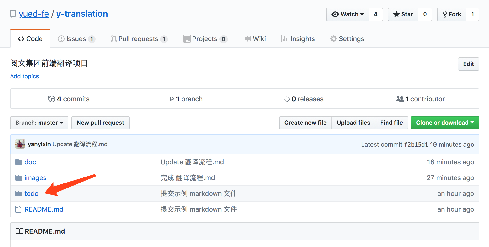
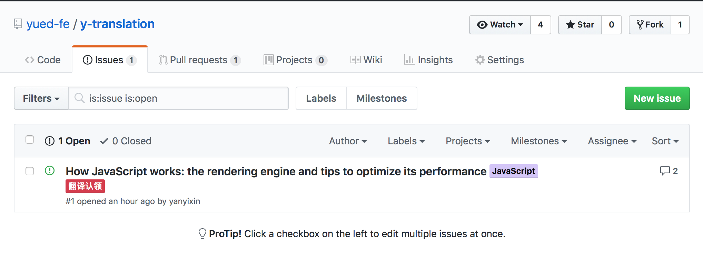
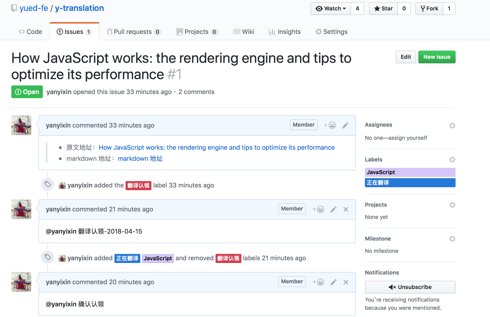

## 上传文章规范

### 一、获取 markdown 格式的文章

有一些文章里面可能会有作者 `github` 的连接，在 `github` 中可以直接获取文章的 `Markdown` 格式。但是有的文章难以获取 `Markdown` 格式，在这里我推荐一篇[文章](https://www.jianshu.com/p/23cd96038d98)，文章里有写如何快速的将 `HTML` 转化为 `Markdown` 格式。

### 二、将文章放在 todo 文件夹下面

### 三、提交一个 Issue
提交 Issue 是为了方便大家认领文章。

Issue 的 label 应该包含该文章所涉及的语言以及目前的状态，如下图所示：

Issue 里面应该贴上原文地址，以及 `Markdown` 地址。其中 `Markdown` 地址就是在第一步中产生的地址。如下图所示：

 

