# 翻译流程

翻译的大致过程可以参考下图：

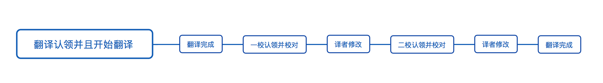

具体流程可以参考下面的详细文档👇。

## 一、认识 Issue 的各种状态
 在[目标翻译项目的 Issues 中](https://github.com/yued-fe/y-translation/issues)提供了目前可认领分配的任务，任务采用文章的标题命名，同时可在列表中查看任务状态，如图所示。

 文章名称后面跟随着此文章所涉及的语言以及当前任务的状态。任务在进行到不同的阶段，Master 会根据进展情况进行手动状态同步，可变更的任务状态分为一下 9 种：

## 二、翻译流程
### 1、翻译认领
译者可以在 Issues 中选择具有 `翻译认领` 标签的任务，在 Issue 下留言并**附上翻译完成时间**（格式：`翻译认领-2018-04-15`），Master 会确认认领并修改 Issue 状态为`正在翻译`。

 

### 2、把项目 Fork 到自己的仓库

### 3、开始翻译

译者认领结束之后准备开始翻译。Github 进入自己刚刚 fork 的仓库，并 clone 到本地。然后**在本地新建一个分支**，命名规则为 `feature/要翻译的文章的标题`，比如我要翻译 `How-JavaScript-works-the-rendering-engine-and-tips-to-optimize-its-performance.md` 这个文件，那分支就可以命名为 `feature/how-javascript-works`。

新建好分支之后就可以开始翻译啦👏。以 `/todo/How-JavaScript-works-the-rendering-engine-and-tips-to-optimize-its-performance.md` 为例，打开文件，直接开始翻译并产生修改信息。如下图所示，我翻译了标题：

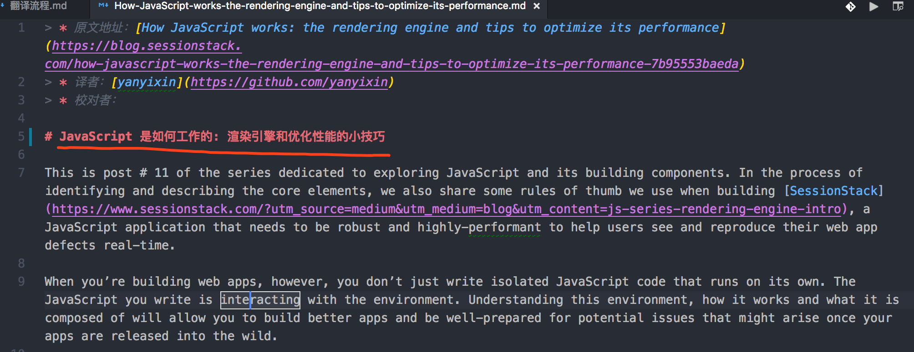

翻译完之后，可以通过 `sourceTree` 查看产生的差异：

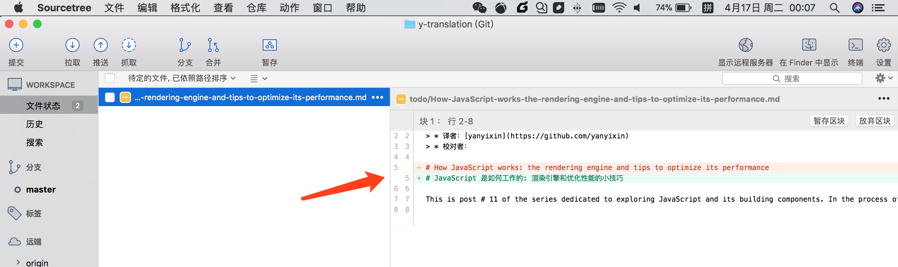

当你翻译好之后，就可以和平时提交代码一样进行提交啦～ 

**注意：** 只有当完全翻译好之后，才可以进行下一步“发起 Pull request”。

### 4、完成翻译，发起 Pull request

译者在自建的分支翻译完成之后，发起 `Pull request`，如下图所示。

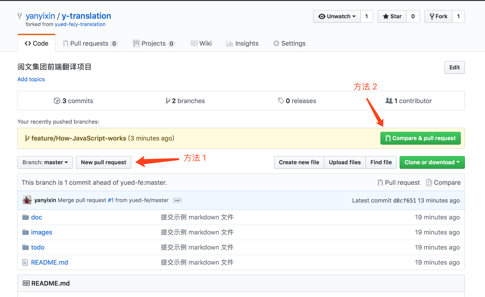

创建一个新的 `Pull Request`，选择 base 为原项目的 `master` 分支主干，选择 `compare` 为创建的翻译文章分支（此处为`feature/How-JavaScript-works`）。如下图：

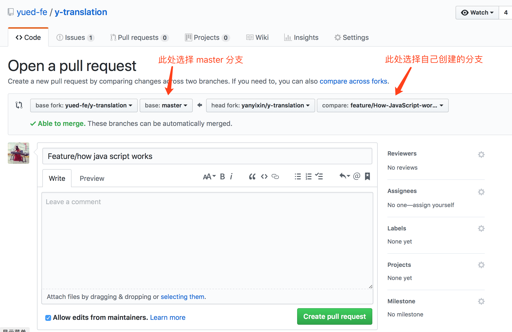

如上图，单击底部的 `Create pull request` 绿色按钮，创建 PR。在 PR 上留言 `初稿翻译完成`，**并附上对应的 Issue 链接**， Master 收到留言会修改 pr 的状态。

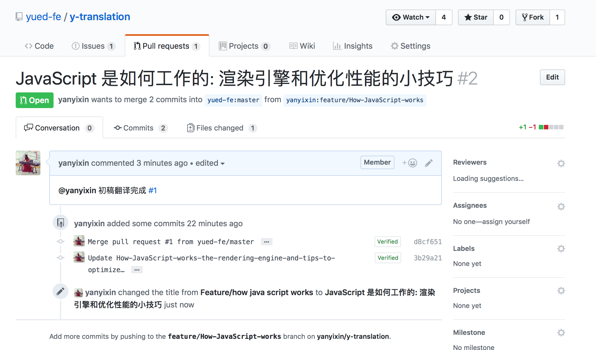

**注意： 提交的 PR 标题应该为翻译的文章的中文标题。**

## 二、校对流程
### 1、认领校对
> 校对有两轮，分别为**一校**和**二校**，两次校对是有先后顺序的，第一次校对完成之后，才可以进行第二次校对。两次校对的具体操作都是一样的。

// todo: 需要给一个校对规范的链接，一校和二校的区别

认领校对的成员可以是对这篇文章感兴趣的成员，也可以是同一组的成员。

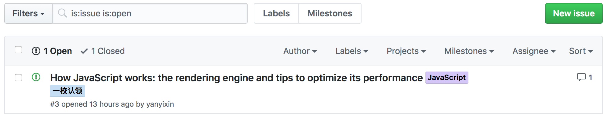

如需认领，在对应的 PR 下留言，并附上校对完成时间即可（格式： `一校认领-2018-04-23`）。Master 收到留言会确认校对的授权工作。此时，校对者就可以开始校对工作了。

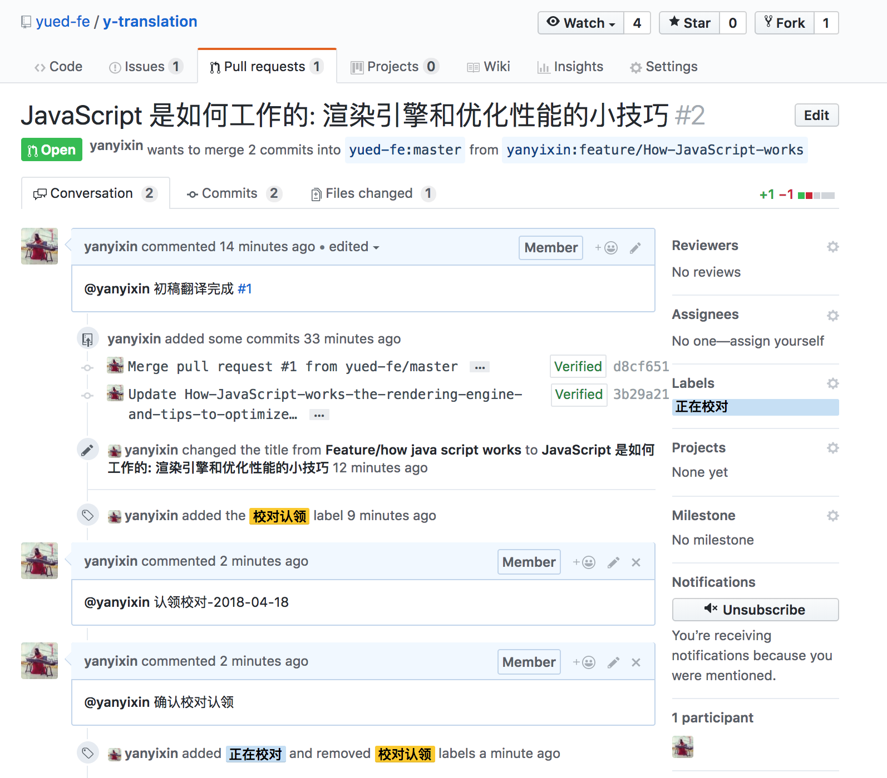

### 2、开始校对
进入已经认领校对的 PR 页面，点击 `Files changed` 查看变更内容，校对在问题行上填写批注建议。如下图所示。

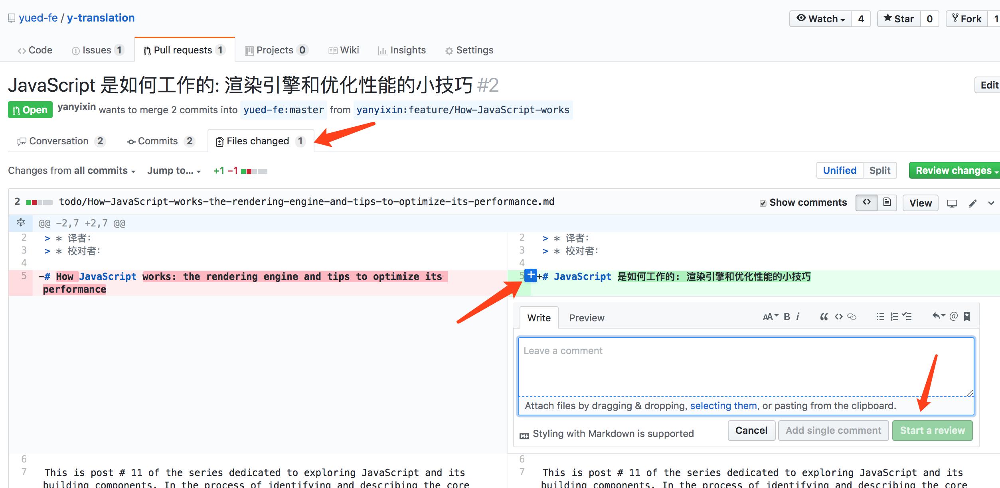

填写好建议之后，译者就能看到对应的批注了。

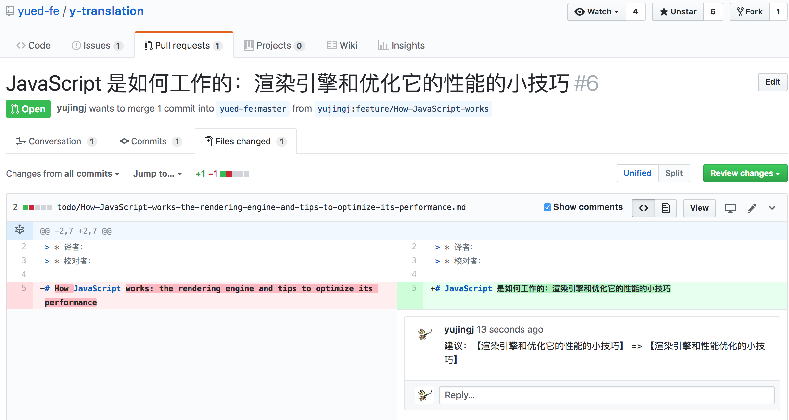

### 3、校对完成
校对者完成校对后，在该 PR 下留言`校对完成`，并且 @ Master。Master 收到消息之后会 @ 译者来进行修改。

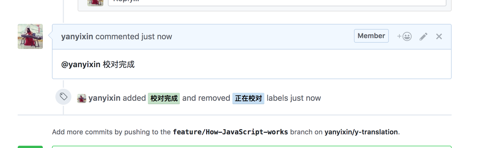

### 三、译者修改
校对完成之后，Master 会通知译者前往 PR 查看校对者留言信息。译者根据留言修改译文。译者自身确认修改完毕后，进入该 PR 页面，留言`修改完成`，并且 @ Master。

### 四、第二次校对重复上面的校对流程

### 五、翻译完成
项目 Master 看到 PR 内的`修改完毕`留言，执行对应 PR 的合并，整块流程结束。
